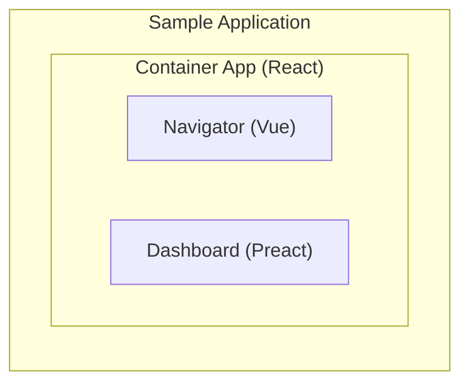

# Micro Frontend Demo with Module Federation

### Diagram of the project

The project uses [module federation](https://module-federation.io/practice/overview.html)

For convenience you can run the `run.sh` to run multiple npm run scripts in the project. 
